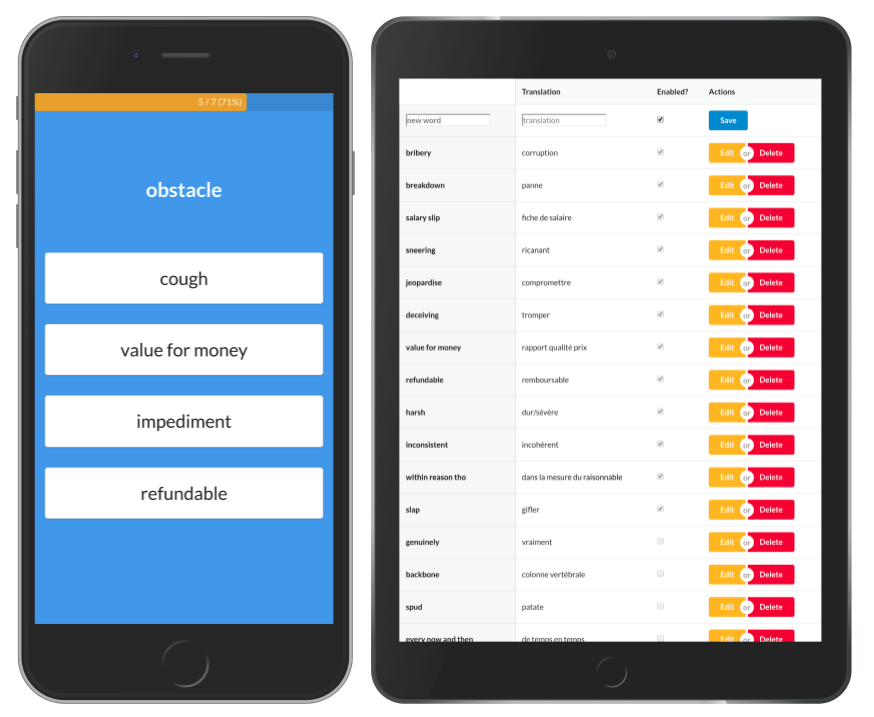

# Dictionary Game

[](https://travis-ci.org/maxpou/dictionary-game) [](https://standardjs.com) [](https://github.com/facebook/jest) [](https://greenkeeper.io/)


A small web app to improve my english vocabulary.



## [Go to the application](https://maxpou.github.io/dictionary-game/#/)

## What's Included: 

* [Vue.js](https://vuejs.org/): an awesome JS Framework ❤️
  * [vue-router](https://router.vuejs.org/en/)
  * [vuex](https://vuex.vuejs.org/en/): for state management
* [jest](https://facebook.github.io/jest/): for unit testing
* [Firebase](https://console.firebase.google.com/) for authentication + database
* [SemanticUI](http://semantic-ui.com/): CSS Framework.


Based on [vue-cli 3](https://github.com/vuejs/vue-cli/blob/dev/docs/README.md#conventions) and follow his file structure/conventions.


## Firebase

This application use Firebase for Authentication and Data storage.  
In this project, I use 2 project to separate environments:

API ENDPOINTS                                  | Environment       
---------------------------------------------- | ------------------
<https://translate-2f28d.firebaseio.com/>      | Production        
<https://translate-test-aee8f.firebaseio.com/> | Dev / Test        

Database access rules:

```json
{
  "rules": {
    "users": {
      "$uid": {
        ".read": "$uid === auth.uid",
        ".write": "$uid === auth.uid"
      }
    }
  }
}
```

Data structure:

```js
├── users/
│   └── {userID}/
|       └── words/
│           ├── {wordId}/
│               // example of a word:
│               {
│                 content: "a word",
│                 enabled: true,
│                 translation: "a word translation"
│               }
```

**Notes:**

* [Why I don't use array with Firebase](https://firebase.googleblog.com/2014/04/best-practices-arrays-in-firebase.html)
* [How to get a Firebase token (official doc)](https://firebase.google.com/docs/reference/rest/database/user-auth)

## Dev tools

Available commands:

* `npm run serve`: start a mini HTTP server
* `npm run build` build for production
* `npm run lint`: lint code
* `npm test`: run unit tests

More information in the [official documentation](https://github.com/vuejs/vue-cli/blob/dev/docs/cli-service.md)

## Deployment

This app is hosted by [Github Pages](https://pages.github.com/) and the Deployment is fulfilled by [Travis CI](https://travis-ci.org/maxpou/dictionary-game) (lint+tests must be green).
